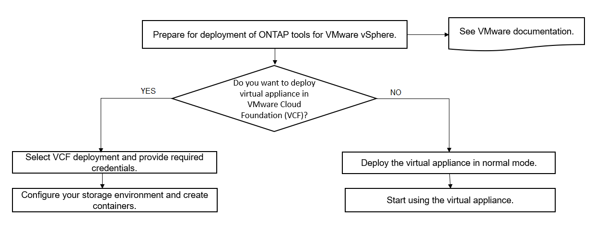

= ONTAP ツールの VMware Cloud Foundation 配置モード
:allow-uri-read: 
:icons: font
:imagesdir: ../media/

[role="lead"]
VMware vSphere 用の ONTAP ツールは、 VMware Cloud Foundation （ VCF ）環境に導入できます。VCF の導入の主な目的は、クラウドセットアップで ONTAP ツールを使用し、 vCenter Server なしでコンテナを作成することです。

VCF モードでは、 vCenter Server を使用せずにストレージ用のコンテナを作成できます。VCF モードで ONTAP ツールを導入したあと、 VASA Provider はデフォルトで有効になります。導入が完了したら、 REST API を使用してストレージシステムを追加し、コンテナを作成できます。API 呼び出しを認証する _apply-api-token_ を生成する新しい API が導入されました。既存の API の中には、 _apply-api-token_header が含まれるように変更されたものもあります。

VCF 展開モードで使用できる API は次のとおりです。

|===

| * API * | * HTTP メソッド * | * 新規 / 変更済み * | * セクションヘッダー * 

 a| 
/1.0/admin/containers を使用してください
 a| 
取得
 a| 
新規
 a| 
コンテナ

 a| 
/1.0/admin/containers を使用してください
 a| 
投稿（ Post ）
 a| 
新規
 a| 
コンテナ

 a| 
/1.0/VCF/user/login
 a| 
投稿（ Post ）
 a| 
新規
 a| 
ユーザ認証

 a| 
/1.0/admin/storage-systems
 a| 
取得
 a| 
変更されました
 a| 
ストレージシステム

 a| 
/1.0/admin/storage-systems
 a| 
投稿（ Post ）
 a| 
変更されました
 a| 
ストレージシステム

 a| 
/2.0/ ストレージ / クラスタ / 検出
 a| 
投稿（ Post ）
 a| 
変更されました
 a| 
ストレージシステム

 a| 
/2.0/ ストレージ / 機能プロファイル
 a| 
取得
 a| 
変更されました
 a| 
ストレージ機能プロファイル

 a| 
/2.0/tasks/{id}
 a| 
取得
 a| 
変更されました
 a| 
タスク

|===
VCF 導入モードでは、 VVOL データストアのみを使用できます。コンテナを作成するには、 VCF 導入用にカスタマイズした REST API を使用する必要があります。導入完了後、 Swagger インターフェイスから REST API にアクセスできます。VCF モードでコンテナを作成する際には、 Storage VM 、アグリゲート、およびボリュームの名前を指定する必要があります。これらのリソース用の ONTAP ツールは更新されないため、 ONTAP API を使用してこれらの詳細を取得する必要があります。

|===

| * ストレージオブジェクト * | * API * 

 a| 
Storage VM
 a| 
API / SVM

 a| 
アグリゲート
 a| 
ストレージ / アグリゲート

 a| 
ボリューム
 a| 
ストレージ / ボリューム

|===
コンテナ作成 API の実行中に、コンテナに既存のボリュームを追加できます。ただし、既存のボリュームの圧縮と重複排除の値がコンテナのストレージ機能に一致していることを確認する必要があります。値が一致しない場合、仮想マシンの作成は失敗します。次の表に、対応するストレージ機能プロファイルについて、既存のボリュームに必要な値の詳細を示します。

|===

| * コンテナストレージ機能プロファイル * | * 重複排除 * | * 圧縮 * 

 a| 
プラチナ
 a| 
両方
 a| 
両方

 a| 
AFF のシック
 a| 
両方
 a| 
両方

 a| 
AFF_Default
 a| 
両方
 a| 
両方

 a| 
AFF_Tiering
 a| 
両方
 a| 
両方

 a| 
AFF_encrypted
 a| 
両方
 a| 
両方

 a| 
AFF_encrypted_Tiering
 a| 
両方
 a| 
両方

 a| 
AFF_encrypted_Min50
 a| 
両方
 a| 
両方

 a| 
FAS_DEFAULT
 a| 
背景（ Background ）
 a| 
なし

 a| 
FAS_Max20
 a| 
背景（ Background ）
 a| 
なし

 a| 
ブロンズ
 a| 
なし
 a| 
なし

|===
ONTAP パッチ API を使用して適切な値を設定できます。

https://<machine_IP>/api/storage/volumes/{uuid}`

ONTAP ツールの VCF 配置では、コンテナ作成ワークフローのみが可能です。データストアのプロビジョニング、ストレージ機能プロファイルの作成、ディザスタリカバリなどの他のワークフローを使用する場合は、 Register.html ページを使用して vCenter Server に ONTAP ツールを登録する必要があります。VCF モードでの ONTAP ツールの制限事項は、ディザスタリカバリ用に SRA を設定できないことです。

link:../deploy/task_deploy_ontap_tools.html["ONTAP ツールの導入方法"]
