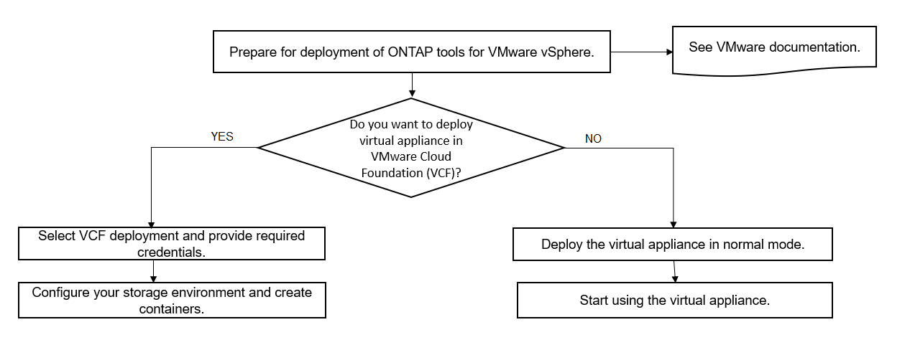

= ONTAP ツールの VMware Cloud Foundation 配置モード
:allow-uri-read: 
:icons: font
:imagesdir: ../media/

[role="lead"]
VMware vSphere 用の ONTAP ツールは、 VMware Cloud Foundation （ VCF ）環境に導入できます。VCF の導入の主な目的は、クラウドセットアップで ONTAP ツールを使用し、 vCenter Server なしでコンテナを作成することです。

VCF モードでは、 vCenter Server を使用せずにストレージ用のコンテナを作成できます。VCF モードで ONTAP ツールを導入したあと、 VASA Provider はデフォルトで有効になります。導入が完了したら、REST APIを使用して、ストレージシステムの追加、削除、変更、コンテナの作成を行うことができます。

NOTE: ストレージシステムの変更と削除は、ONTAP tools for VMware vSphere 9.13P1リリース以降でサポートされます。

以下の記事に、VCFが有効な場合にONTAP toolsにストレージを追加するための手順が記載されています。 https://kb.netapp.com/mgmt/OTV/SRA/Storage_Replication_Adapter%3A_How_to_configure_SRA_in_a_SRM_Shared_Recovery_Site["Swagger-UIからONTAPツールへのストレージの追加"]。

API 呼び出しを認証する _apply-api-token_ を生成する新しい API が導入されました。既存の API の中には、 _apply-api-token_header が含まれるように変更されたものもあります。ONTAP tools 9.12以降では、Swaggerは1.0 APIをサポートしません。これまで1.0で使用されていたポインタは、2.0または3.0 APIに移動されます。

NOTE: ONTAP tools for VMware vSphere 9.13リリースでは、2.0ストレージ機能プロファイルAPIは使用できなくなりました。

VCF 展開モードで使用できる API は次のとおりです。

|===

| * API * | * HTTP メソッド * | * 新規 / 変更済み * | * セクションヘッダー * 

 a| 
/2.0/admin/containersを参照してください
 a| 
取得
 a| 
新規
 a| 
コンテナ

 a| 
/2.0/admin/containersを参照してください
 a| 
投稿（ Post ）
 a| 
新規
 a| 
コンテナ

 a| 
/2.0/vcf/user/login
 a| 
投稿（ Post ）
 a| 
新規
 a| 
ユーザ認証

 a| 
/3.0 /ストレージ/クラスタ
 a| 
取得
 a| 
変更されました
 a| 
ストレージシステム

 a| 
/3.0 /ストレージ/クラスタ
 a| 
投稿（ Post ）
 a| 
変更されました
 a| 
ストレージシステム

 a| 
/3.0 /ストレージ/クラスタ
 a| 
削除
 a| 
新規
 a| 
ストレージシステム

 a| 
/3.0 /ストレージ/クラスタ
 a| 
PUT
 a| 
新規
 a| 
ストレージシステム

 a| 
/2.0/ ストレージ / クラスタ / 検出
 a| 
投稿（ Post ）
 a| 
変更されました
 a| 
ストレージシステム

 a| 
/2.0/ ストレージ / 機能プロファイル
 a| 
取得
 a| 
変更されました
 a| 
ストレージ機能プロファイル

 a| 
/2.0/tasks/{id}
 a| 
取得
 a| 
変更されました
 a| 
タスク

|===
VCF 導入モードでは、 VVOL データストアのみを使用できます。コンテナを作成するには、 VCF 導入用にカスタマイズした REST API を使用する必要があります。導入完了後、 Swagger インターフェイスから REST API にアクセスできます。VCF モードでコンテナを作成する際には、 Storage VM 、アグリゲート、およびボリュームの名前を指定する必要があります。これらのリソース用の ONTAP ツールは更新されないため、 ONTAP API を使用してこれらの詳細を取得する必要があります。

|===

| * ストレージオブジェクト * | * API * 

 a| 
Storage VM
 a| 
API / SVM

 a| 
アグリゲート
 a| 
ストレージ / アグリゲート

 a| 
ボリューム
 a| 
ストレージ / ボリューム

|===
コンテナ作成 API の実行中に、コンテナに既存のボリュームを追加できます。ただし、既存のボリュームの圧縮と重複排除の値がコンテナのストレージ機能に一致していることを確認する必要があります。値が一致しない場合、仮想マシンの作成は失敗します。次の表に、対応するストレージ機能プロファイルについて、既存のボリュームに必要な値の詳細を示します。

|===
| * コンテナストレージ機能プロファイル * | * 重複排除 * | * 圧縮 * 

 a| 
Platinum_AFF_A
 a| 
両方
 a| 
両方

 a| 
Platinum_AFF_C
 a| 
両方
 a| 
両方

 a| 
Platinum_asa_a
 a| 
両方
 a| 
両方

 a| 
Platinum_ASA_C
 a| 
両方
 a| 
両方

 a| 
AFF_NVMe_AFF_A
 a| 
両方
 a| 
両方

 a| 
AFF_NVMe_AFF_C
 a| 
両方
 a| 
両方

 a| 
AFF_NVMe_ASA_A
 a| 
両方
 a| 
両方

 a| 
AFF_NVMe_ASA_C
 a| 
両方
 a| 
両方

 a| 
AFF_Thick_AFF_A
 a| 
両方
 a| 
両方

 a| 
AFF_Thick_AFF_C
 a| 
両方
 a| 
両方

 a| 
AFF_Thick_ASA_A
 a| 
両方
 a| 
両方

 a| 
AFF_Thick_ASA_C
 a| 
両方
 a| 
両方

 a| 
AFF_DEFAULT_AFF_A
 a| 
背景（ Background ）
 a| 
なし

 a| 
AFF_DEFAULT_AFF_C
 a| 
背景（ Background ）
 a| 
なし

 a| 
AFF_DEFAULT_ASA_A
 a| 
背景（ Background ）
 a| 
なし

 a| 
AFF_DEFAULT_ASA_C
 a| 
背景（ Background ）
 a| 
なし

 a| 
AFF_Tiering_AFF_A
 a| 
両方
 a| 
両方

 a| 
AFF_Tiering_AFF_C
 a| 
両方
 a| 
両方

 a| 
AFF_Tiering_ASA_A
 a| 
両方
 a| 
両方

 a| 
AFF_Tiering_ASA_C
 a| 
両方
 a| 
両方

 a| 
AFF_Encrypted_AFF_A
 a| 
両方
 a| 
両方

 a| 
AFF_Encrypted_AFF_C
 a| 
両方
 a| 
両方

 a| 
AFF_Encrypted_ASA_A
 a| 
両方
 a| 
両方

 a| 
AFF_Encrypted_ASA_C
 a| 
両方
 a| 
両方

 a| 
AFF_Encrypted_Tiering_AFF_A
 a| 
両方
 a| 
両方

 a| 
AFF_Encrypted_Tiering_AFF_C
 a| 
両方
 a| 
両方

 a| 
AFF_Encrypted_Tiering_ASA_A
 a| 
両方
 a| 
両方

 a| 
AFF_Encrypted_Tiering_ASA_C
 a| 
両方
 a| 
両方

 a| 
AFF_Encrypted_Min50_AFF_A
 a| 
両方
 a| 
両方

 a| 
AFF_Encrypted_Min50_AFF_C
 a| 
両方
 a| 
両方

 a| 
AFF_Encrypted_Min50_ASA_A
 a| 
両方
 a| 
両方

 a| 
AFF_Encrypted_Min50_ASA_C
 a| 
両方
 a| 
両方

 a| 
ブロンズ
 a| 
なし
 a| 
なし

|===
ONTAP パッチ API を使用して適切な値を設定できます。

`\https://<machine_IP>/api/storage/volumes/{uuid}`

ONTAP tools for VMware vSphereのVCF導入では、コンテナ作成ワークフローのみが可能です。データストアのプロビジョニング、ストレージ機能プロファイルの作成、ディザスタリカバリなど、他のワークフローを使用する場合は、swaggerページを使用してONTAP toolsをvCenter Serverに登録する必要があります。ONTAP tools 9.12以降では、SwaggerページからvCenterへのONTAP toolsの登録が行われます。VCFモードのONTAP toolsの制限事項は、プラグインを登録するまでディザスタリカバリ用にSRAを設定できないことです。VCFモードを使用せずにONTAP ツールを展開すると、登録が自動的に行われます。

NOTE: ONTAP toolsの今後のリリースでは、Register.htmlが削除されます。

link:../deploy/task_deploy_ontap_tools.html["ONTAP ツールの導入方法"]
